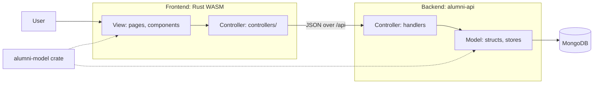
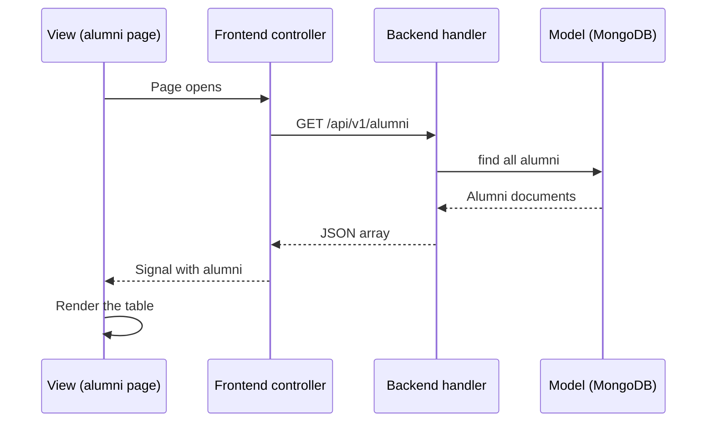

# Alumni Tracking System

This is an alumni tracking app for the Web Development class of fall 2026-2027.

## Writing style

Write the README and all files in `docs/` in Simplified Technical English (ASD-STE100).

- Use short sentences. Use the active voice.
- Use one term for one thing. Do not use synonyms.
- Use the imperative form for steps.
- Do not use idioms, contractions, or abbreviations that you do not define.

## Status

The backend is Rust and runs today. The frontend plan is a Rust WASM app built with Leptos.
The repository still contains the React frontend. It is temporary. The Leptos frontend replaces
it, and all `.ts` and `.tsx` files go away. The Stack, Layout and MVC sections describe the
planned frontend. The sections for the backend describe the code as it is today.

## Stack

- **Backend:** Rust, actix-web 4, MongoDB (official driver). Service: `alumni-api`.
- **Frontend (planned):** Rust compiled to WASM. Framework: Leptos in client-side rendering (CSR)
  mode. Build tool: Trunk. Styling: Tailwind CSS. nginx serves the built files.
- **Shared model (planned):** one Rust crate, `alumni-model`, used by the backend and the frontend.
- **Database:** MongoDB 7.
- **Runtime:** all parts run in Docker with `docker compose`.

## Layout

```
alumni/
  services/alumni-api/    # Rust actix-web backend
  frontend/               # Rust + Leptos WASM client (planned; React client until then)
  crates/alumni-model/    # Shared Model structs (planned)
  docs/                   # backlog, done log, trade-offs, architecture diagrams
  docker-compose.yml
  AGENTS.md
```

## MVC structure

The system uses the Model-View-Controller (MVC) pattern across the whole stack.

| Layer | Job | Where it lives |
| --- | --- | --- |
| Model | Holds the data, the data rules and the data storage. | `alumni-model` crate, `alumni-api` data code, MongoDB |
| View | Shows data to the user. | Leptos pages and components, nginx |
| Controller | Receives input, calls the Model and selects the result. | `alumni-api` handlers, frontend `controllers/` module |



### Request flow: list the alumni



### Backend mapping (current code)

Docker Compose starts all layers. It is the shared wiring and is not part of one layer.

| Layer | Part | File or container |
| --- | --- | --- |
| Model | Data shapes `Alumni`, `User`, `CreateUser`, `UpdateUser` | `services/alumni-api/src/models.rs` |
| Model | MongoDB collection handle | `AppState` in `main.rs` |
| Model | In-memory user store `UserStore` with `create`, `get`, `list`, `replace`, `update`, `delete` | `services/alumni-api/src/user_store.rs` |
| Model | Data rules: `validate_name`, `validate_email` and the `UserError` type | `services/alumni-api/src/user_store.rs` |
| Model | Database settings and bind address | `services/alumni-api/src/config.rs` |
| Model | Sample data and import | `seed/alumni.json`, `mongo-seed` container |
| Model | Database | `mongo` container |
| Controller | Route functions for health, hello, sum and alumni | `services/alumni-api/src/handlers.rs` |
| Controller | `UserController`: functions for the user pages (list, create, show, edit, update, delete) | `services/alumni-api/src/controllers/user_controller.rs` |
| Controller | `ApiUserController`: functions for the user JSON CRUD | `services/alumni-api/src/controllers/api_user_controller.rs` |
| Controller | Route tables: `user.rs` (pages) and `api_user.rs` (JSON) | `services/alumni-api/src/routes/` |
| Controller | Error type and HTTP status mapping `ApiError` | `services/alumni-api/src/error.rs` |
| Controller | Start of the route tables, `/api/v1` scope, OpenAPI and Swagger UI | `services/alumni-api/src/main.rs` |
| View | HTML pages for users (maud templates) | `services/alumni-api/src/views/` |
| View | JSON responses that the API returns | Serde derive on the Model structs |

### Frontend mapping (planned)

| Layer | Part | Planned location |
| --- | --- | --- |
| Model | `Alumni` and `User` structs | `crates/alumni-model/` |
| Controller | Functions and signals that call the API and hold the page state | `frontend/src/controllers/` |
| Controller | Route table | `frontend/src/app.rs` |
| View | Page components | `frontend/src/pages/` |
| View | Shared components (layout, theme toggle, table) | `frontend/src/components/` |
| View | Tailwind CSS styles | `frontend/` stylesheet |
| View | Static file server | `frontend` container (nginx) |

### Rules

- A View must not call the API. It must call a controller.
- A controller must not hold data rules. It must call the Model.
- The Model must not know about HTTP, routes or pages.
- The backend and the frontend must import `Alumni` and `User` from `alumni-model`. Do not copy them.

### Known gaps

- `list_alumni` in `handlers.rs` queries MongoDB directly. No separate Model function exists.
- Two data sources exist: MongoDB for alumni, and memory for users. The user data resets on restart.
  See `docs/trade-offs.md`.
- The `alumni-model` crate and the `crates/` folder are not in the repository yet. `AGENTS.md`
  must list the `crates/` folder when you add it.
- Docker builds for `alumni-api` and the frontend must use the repository root as build context
  to read the shared crate.

## Run

All services run in Docker. You do not need a host toolchain.

```bash
docker compose up --build
```

Then open these addresses:

- Frontend: http://localhost (nginx serves the built app on port 80)
- API: http://localhost:8080/api/v1/alumni

The first `up` command fills MongoDB with sample alumni. The `mongo-seed` container does this.

## Routes

The SPA has these pages: `/` (home), `/alumni` (list) and `/about` (placeholder with a Prufrock
poem). For an unknown path, the SPA router shows the 404 page.

The API has these routes under `/api/v1`. Use port 8080 for the API or port 80 for the gateway.

| Route | Returns |
| --- | --- |
| `GET /api/v1/alumni` | The alumni from MongoDB |
| `GET /api/v1/hello` | `"hello, world"` |
| `GET /api/v1/hello/{variable}` | `"hello, {variable}!"` |
| `GET /api/v1/sum/{num1}/{num2}` | `num1 + num2` as a bare JSON number (f64) |

`ApiUserController` serves the user JSON routes under `/api/v1/users`. The same routes also work
under `/api/users`. The user store is in memory and resets on restart. See `docs/trade-offs.md`.

| Route | Returns |
| --- | --- |
| `POST /api/v1/users` | The new user (status 201). Fields: `name`, `email` |
| `GET /api/v1/users` | All users, ordered by id |
| `GET /api/v1/users/{id}` | One user, or status 404 |
| `PUT /api/v1/users/{id}` | Full replacement, or status 404 |
| `PATCH /api/v1/users/{id}` | Partial update, or status 404 |
| `DELETE /api/v1/users/{id}` | Status 204, or status 404 |
| `GET /api/health` | `{"status": "ok"}` |
| `GET /api/swagger` | Swagger UI (redirects to `/api/swagger/`) |

`UserController` serves the user pages as HTML. An HTML form sends only GET and POST. For this
reason, update and delete are POST routes. After a successful change, the page redirects
(status 303). If the input is not valid, the page shows the error with status 400. If the user
does not exist, the page shows an HTML 404 page.

| Route | Returns |
| --- | --- |
| `GET /users` | The user list and the create form |
| `POST /users` | Creates a user from the form fields `name` and `email` |
| `GET /users/{id}` | The page for one user |
| `GET /users/{id}/edit` | The edit form for one user |
| `POST /users/{id}` | Replaces `name` and `email` of one user |
| `POST /users/{id}/delete` | Deletes one user |

The Swagger UI shows all user routes, grouped by the tags `UserController` and
`ApiUserController`: http://localhost:8080/api/swagger. The gateway also serves it at
http://localhost/api/swagger. The gateway proxies `/users` to the API.

The gateway on port 80 proxies these short routes to the API: `/hello`, `/hello/{variable}` and
`/sum/{num1}/{num2}`. They return the same responses as the routes without the `/api/v1` prefix.
See `docs/trade-offs.md`.

## Documentation

- `docs/architecture/` - Mermaid diagrams (system context, containers, read flow) and how to view them.
- `docs/backlog.md` - planned work, in priority order.
- `docs/done.md` - log of completed work.
- `docs/trade-offs.md` - decisions and compromises.

Read `AGENTS.md` for the rules that agents and contributors must obey.
